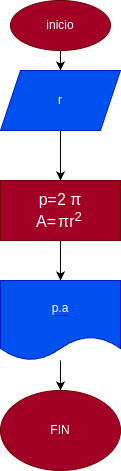

# programa Nº1
programa para calcular el area y el perimetro de un circulo de radio r

# Analisis  
  

## Imput
### Variables de entrada
r: radio del circulo
### Processing
p: perimetro del circulo
p=2πr

a: area del circulo
a=π*r²

# Outout
a.p
# Diseño

# Construccion